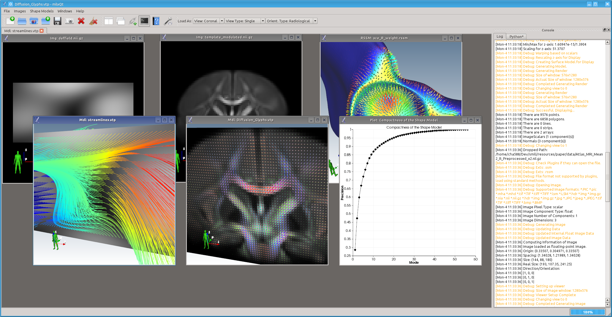





The Simple Medical Imaging Library Interface (SMILI), pronounced 'smilie', is a light weight framework for the rapid development of biomedical imaging applications. Please cite our SMILI publication if you find this project useful:

```
Chandra, S. S.; Dowling, J. A.; Engstrom, C.; Paproki, A.; Neubert, A.; Xia, Y.; Rivest-Hénault, D.; Shen, K.-K.; Salvado, O.; Crozier, S. & Fripp, J.
"A simple framework for the rapid development of biomedical imaging applications"
Computer Methods and Programs in Biomedicine, vol. 164, pp. 193–205, 2018.
```

DOI: https://doi.org/10.1016/j.cmpb.2018.07.011

## Introduction
SMILI is built around Qt, [ITK](https://itk.org/) and [VTK](https://www.vtk.org/), it is divided into three main parts:

 * the sMILX user interface application for medical imaging with just a few mouse clicks.
 * a user-interface dependent library for writing and using easy to use medical imaging applications.
 * a user-interface indepdendent library, so that it easily utilised in your own command line applications. This level can directly interfaces with ITK and VTK.

The milxQt is a Qt4 dependent library that extends milxSMILI to handle user-interface and visualisation using Qt4. The SMILI X Viewer (sMILX) utilises milxQt to create a GUI-application for easy medical imaging and surface processing.

It allows for a very high level access to image and model process and display capabilities. For example, in order to triangulate, decimate, smooth and clean a polygonal surface and display it in coronal view, one simply issues:

```
model->clean();
model->smoothSinc(20); // windowed sinc 20 iterations
model->decimate(0.5); // 50% decimation
model->colourMapToJet();
model->viewToCoronal();
```

Similar syntax is available to the sMILX Python plugin, which has a Python console for autmoating the user interface.

## Prerequisites 
ITK 3.20+ and VTK 5.8+ built and installed. SMILX also requires Qt 4 and CMake to build. SMILI can function with either ITK or VTK installed and will detect each library.
To utilise just the imaging parts of SMILI, you just need ITK. To utilise the surface/model parts of SMILI you just need VTK. To utilise the GUI dependent parts you need both libraries.

On Ubuntu linux systems (12.04+), simply install the repository version of Qt, VTK (with VTK-Qt), PythonQt (to build the Python plugin) and ITK. We reccomend ITK 4.5 and VTK 6.1 and not VTK 5.10.1 which seems to have a number of features broken.
For ITK 3 builds, I suggest a local build of ITK 3 with review enabled to get all the features currently available.

## Build Steps
Detailed build instructions can be found on the [Building page](browse/BUILDING.md). It goes something like:

```
mkdir build
cd build
ccmake .. OR cmake-gui
make OR ninja
```

Use the BUILD_VIEWER to ON to build sMILX and BUILD_PLUGINS to ON to build plugins for sMILX.

## Plugins for sMILX
* For building SMILX Python Plugin
Build PythonQt <pythonqt.sourceforge.net/> and Python 2.x installed

* For building SMILX Animate Plugin (used for making movies)
Build VTK with the FFMPEG Encoder ON

* For building SMILX DICOM Plugin (used for making movies)
Build SMILI with ITK 4.x

* For building SMILX SSM Plugin (used for shape models)
Copy the relelvant SSM source files from the website, use the USE_SSM_LOCAL ot ON and build.
You will need to use ITK 3.20 and VTK 5.8 or VK 5.10.1

## Scripting
All aspects of sMILX can be scripted using the python plugin. Example scripts for sMILX can be found in scripts/ directory with the prefix 'smilx_'. Additional modules for filenames from directories etc. are also in the scripts/ directory.

Applications like milxOverlay can also be run as a batch job. All batch scripts for apps can be found in the scripts/ directory with the prefix 'batch_'. The scripts using the multi-processing module wrapped conveniently in the batch module found in the scripts/ directory.

## Qt 5 Support
The latest changes for supporting Qt 5 is provided for in the [topic-qt5](https://github.com/shakes76/smili/tree/topic-qt5) branch.

### Appendix A - VTK MODULAR
SMILI needs

* Enable Qt and Imaging modules
* Enable IO-PLY, RenderingImage modules
* Modules vtkIOInfovis vtkFiltersProgrammable

milxQt needs:

* Modules vtkRenderingLOD vtkChartsCore vtkViewsContext2D vtkIOExport 
